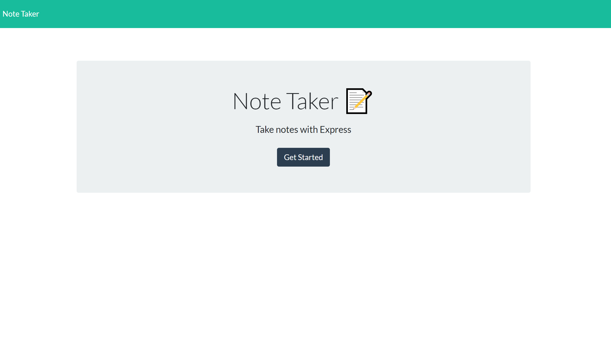
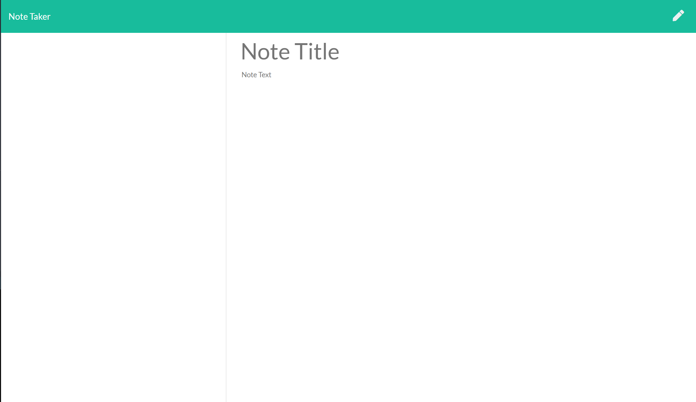
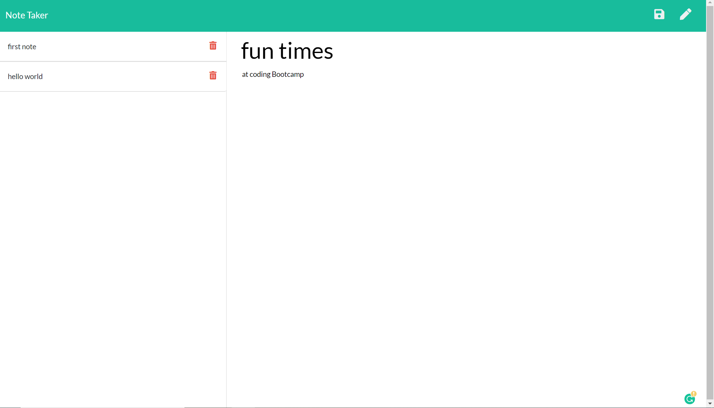
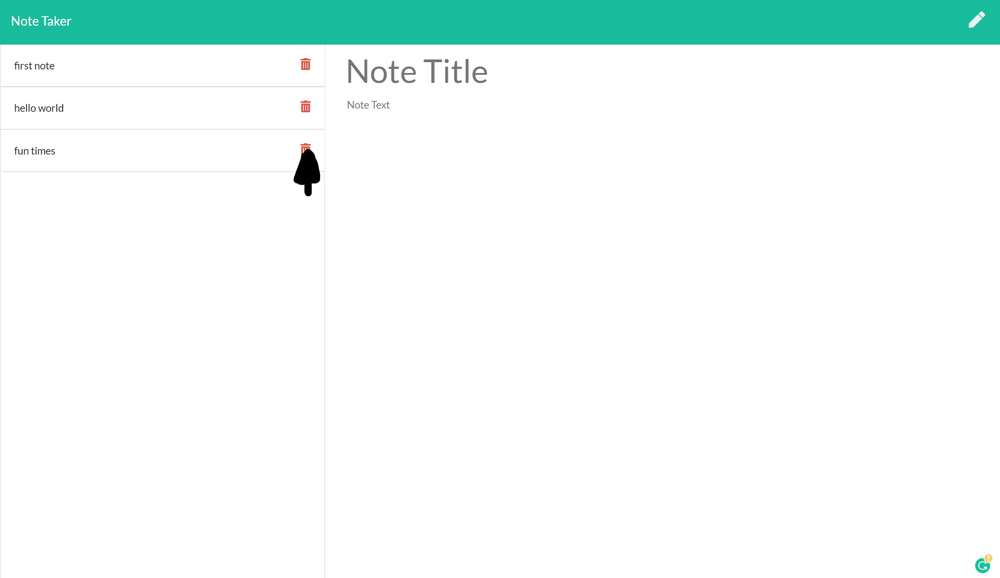
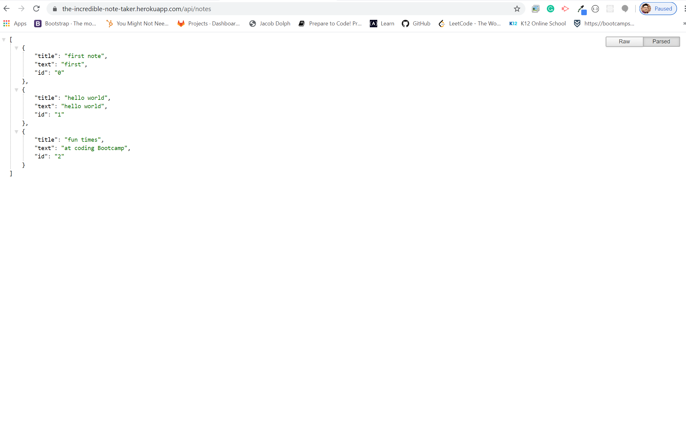

# The Incredible Note Taker
​
## Overview
​
This application will allow you to write a note with a title and save that not, you can access that note by clicking on the title. you may also delete the note by clicking on the trash can icon to the right of the note.
​
### Gallery
​
Home Page

​
Note Taker Page

Taking a note

Deleting a note

The api array

​
​
## Tech and Features Used
​```

* Javascript
* Node.js
* Node Librarys:
Express - Path - Fs
* Routes
* HTML
* Bootstrap
​```
## How to use
​
Navigate to https://the-incredible-note-taker.herokuapp.com/,
click on the get started button.
Once you arrive to the Note taker page, you can add a title to the note title section, and a message to the note text area. when you add text to both areas the save button will reveal itself, and you may save that note. to view your note, note title on the left side of the screen. to delete the note click on the trash can to the right of the note title on the left of the screen.
​
